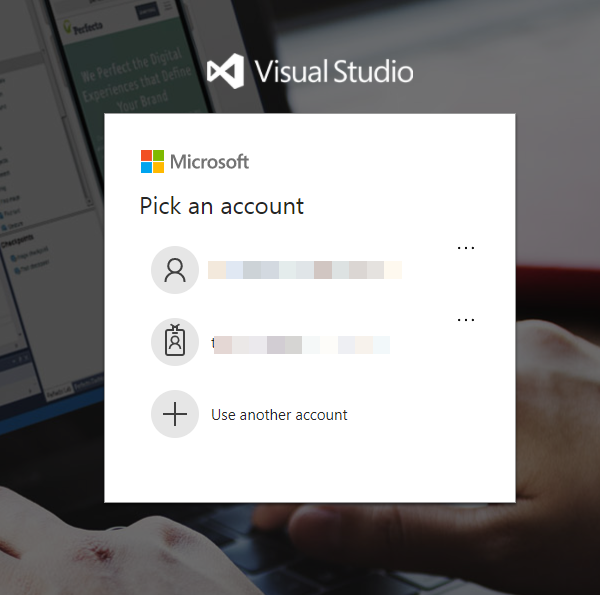
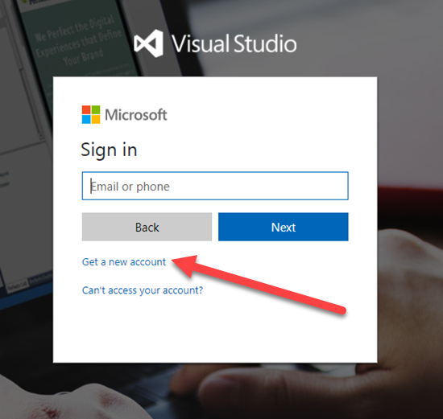
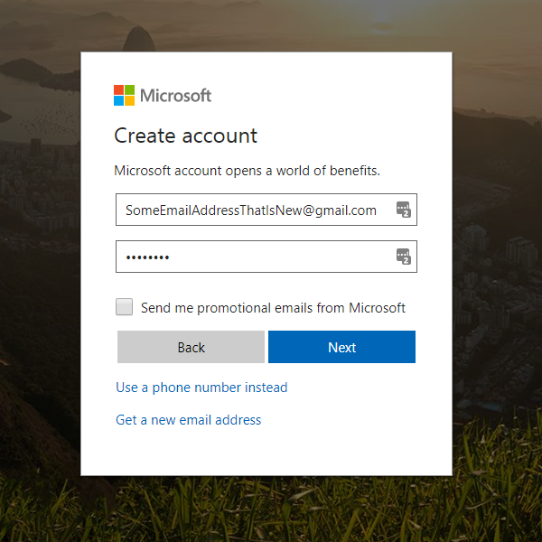
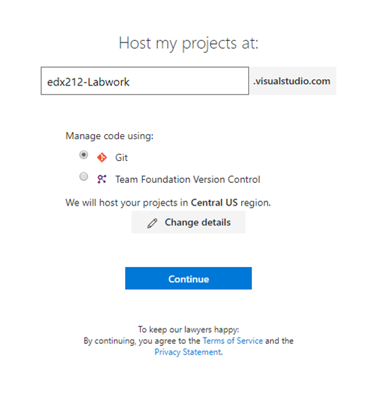
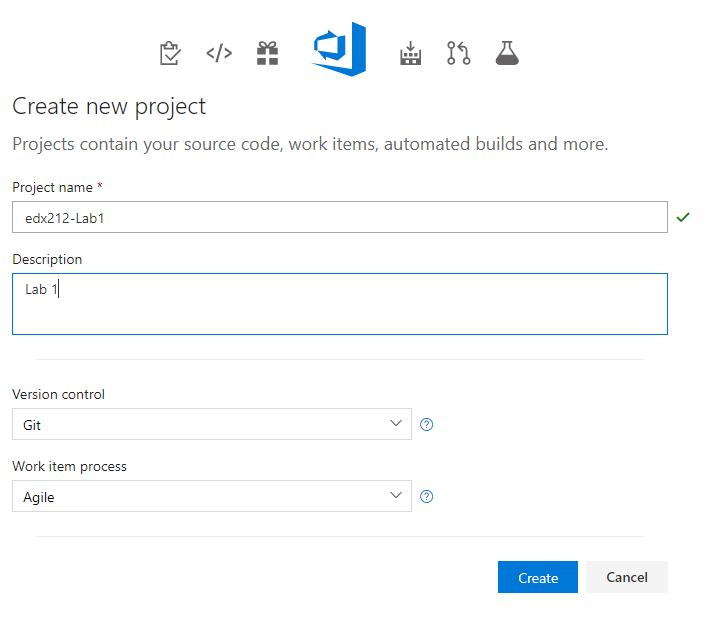

# edX DEV212x Intro to DevOps - LAB 1, Signing up and configuring lab dependencies and prerequisites #
This is the Hands on Lab for module 1 of the Introduction to DevOps course.

The objectives of the labs in this course are to walk through the creation of a DevOps / continuous delivery pipeline that includes infrastructure-as-code, configuration-as-code, as well as code deployment. Although the labs aren't required to successfully complete this course, I highly recommend it, as creating a pipeline really gives you a feel for the power of DevOps.

In order to run a course on DevOps that includes labs, we needed to select a platform on which to build out the exercises. Although this course
is technology stack agnostic, the Visual Studio Team Services (VSTS) and Azure platforms were chosen for the demos and labs. Additionally, git was selected as the version control system due to its availability on all modern operating systems.

Both VSTS and Azure are accessible from a web browser (any operating system) and provide a free tier that is used in this class.
Additionally, only a web browser is required to complete the labs in this course.

The written labs in this course depend on several free prerequisites. However, if you choose, you can use whatever infrastructure platform, release management pipeline and version control system that you like.  However, if you do so, you'll need to translate the labs into your own chosen tools.

### Tasks Overview
1. Create a Visual Studio Team Services (VSTS) account
2. Create an Azure Free Trial account

## Task 1 - Create a Visual Studio Team Services (VSTS) Account ####
> **Note**: If you already have a VSTS account, you can skip this step. However, you need to ensure that it is an account in which you are the account owner. In other words, if you create the account yourself, you can skip this step and just sign into your account. However, if some else created the account and added you to the account, then you will need to complete this step. Once you have signed into your existing account, then create a new Team Project as specified in [Task 3](#Ex4Task2).

1. Sign into [Visual Studio](https://go.microsoft.com/fwlink/?LinkId=307137).

    Enter your Microsoft Account credentials.

    

1. **Note**: If you do not have a Microsoft Account, then you will need to create one by clicking "Sign up now". Once you have created an account, you can sign in using that account.
    
	
	

1. Once you have signed in to your Microsoft account (or created a new one), you should see a panel to create a new Visual Studio Team Services account. If you are not redirected [Click Here](https://www.visualstudio.com/en-us/docs/setup-admin/team-services/sign-up-for-visual-studio-team-services) Click on the "Free Account" button. 

    

1. In the "Create your account" panel, enter the following information: 
	
	- A unique Visual Studio Team Services account name
	- Git as the version control for the team project

	Once you have filled out the information, press the continue button to create the Visual Studio Team Services account.

1. Once the account is created, you will see the VSTS landing page, which will prompt you to create a new Team Project. Continue to the next task.
    
    Enter the following information:
    - A project name - we recommend that you call the project _EdX_
    - Select the **Agile** process template
    - Select **Git** version control
    - Click **Create** button

	

1. Once the project is created, you will be redirected to the Team Project landing page. You will get started importing code in Lab 3.

    

    _The Team Project Landing Page_
    
## Task 2 - Create a Free Azure Trial account ####
> **Note**: If you already have an Azure account, you can skip this step. However, you need to ensure that it is an account in which you are the account owner or administrator. In other words, if you create the account yourself, you can skip this step and just sign into your account. However, if someone else created the account and added you to the account, then you will need to ensure you have sufficient permissions. 

1. To sign up for the Azure Free Trial, visit [Azure Free Trial](https://azure.microsoft.com/en-us/offers/ms-azr-0044p/), and log in with a Microsoft ID. (You can use the same ID you created or used when setting up the VSTS account.) _One catch is that you will need a credit card._ This card is not charged, but it used to prevent bots from creating hundreds of free trials and getting free compute. 

	If you'd like to watch a video, showing how to sign up for a free Azure trial, visit the [Sign up for Azure](https://channel9.msdn.com/Blogs/Windows-Azure/Sign-up-for-Microsoft-Azure) video on Channel9.

	Alternatively, if you have an MSDN subscription, you can activate your free, monthly Azure credits (up to $150/month). Details can be found at the [Azure MSDN Benefits](https://azure.microsoft.com/en-us/pricing/member-offers/msdn-benefits/) site.

