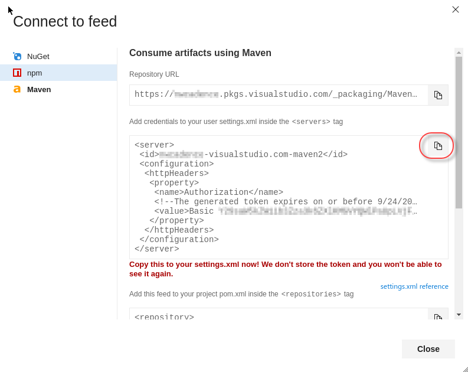
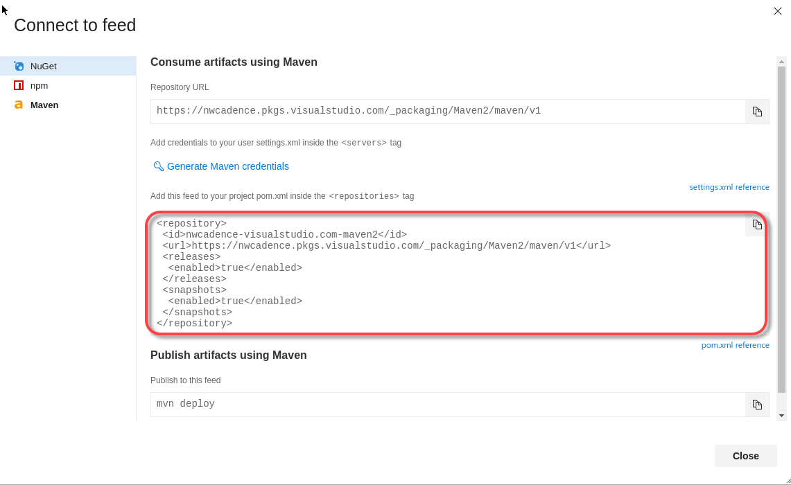
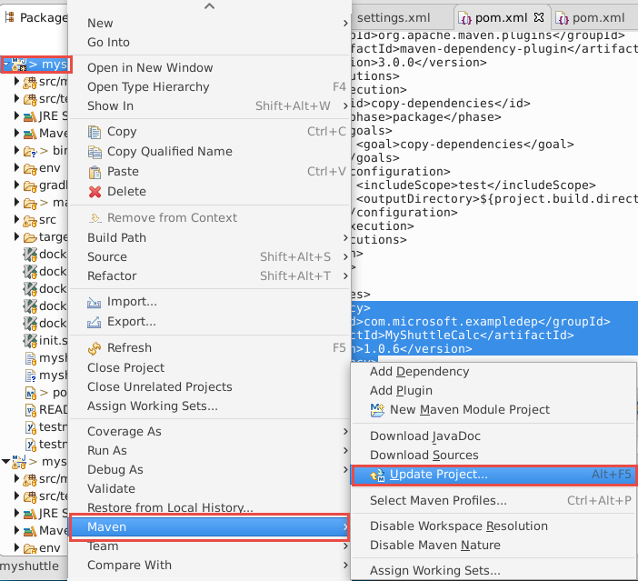

# edX DEV212x Intro to DevOps - LAB 3 (Java/Linux), Signing up and configuring lab dependencies and prerequisites #
This is the Hands on Lab for module 3 of the Introduction to DevOps course - the Linux/Java track.

In this lab we have a Java application called MyShuttle2. This application runs in a Tomcat Docker container. The application reads data from a MySql database that is inside a separate MySql container. The MyShuttle2 requires some business logic that is encapsulated in a separate repo called MyShuttleCalc. You'll need to build the MuShuttleCalc package and publish it to a Maven Package feed so that the MyShuttle2 application can consume it.

We want to set up
Visual Studio Team Services (VSTS) to be able continuously integrate code into the master
branch of code. This means that whenever code is committed and pushed to the
master branch, we want to ensure that it integrates into our code correctly to
get fast feedback. To do so, we are going to be setting up a Continuous Integration build (CI) that
will allow us to compile and run unit tests on our code every time a commit is
pushed to Visual Studio Team Services, as well as push the container images to a container registry so that we can deploy the application.

## Pre-requisites ##

-   Make sure you have completed [LAB 1](../Lab1-linux/EdX212x-Lab1-linux.md) to set up your VSTS account, you Azure trial subscription and your Linux VM. 

## Tasks Overview: ##

1. **Import Source Code into your VSTS Account:** In this step, you will import from GitHub into your own Visual Studio Team Services account.

1. **Create Continuous Integration Build:** In this step, you will create a build definition that will be triggered every time a commit is pushed to your repository in Visual Studio Team Services. 

1. **Test the CI Trigger in Visual Studio Team Services:** In this step, test the Continuous Integration build (CI) build we created by changing code in the Parts Unlimited project with Visual Studio Team Services. 

1. **Set up a Private Build Agent that runs in a Docker container.** In this step you'll configure a private build agent by starting a container based on the Microsoft/vsts-agent image from DockerHub.

1. **Set up a Maven Package build for the MyShuttleCalc repo.** In this step you'll clone the MyShuttleCalc repo and create a build in VSTS to publish the package to a Maven package feed in VSTS so that the MyShuttle2 application can consume the package.

### Connect to VSTS from IntelliJ ###

1. Click on the IntelliJ icon in the toolbar to open IntellJ IDEA.

    

1. The first time you run IntelliJ, it will prompt for IntelliJ settings and theme settings. Click on "Do not import settings," then click on "Skip All and Set Defaults" to use the defaults.

    

1. When the Welcome dialog appears, click Configure and then select Plugins.

    

1. In the search box type `visual studio team services` and click the "Search in repositories" link in the main window.

    

1. Click install to install the extension. The install button will change to a "Restart" button - click it to restart IntelliJ.

    

1. When IntelliJ restarts, the Welcome dialog will appear again. Click "Check out from Version Control" and select "Team Services Git".

    

1. Click on "Sign in..." to sign in to your VSTS account.

    

### Clone MyShuttle2 from VSTS with IntelliJ ###

1. Once you have authenticated, enter "MyShuttle2" into the search bar and select the MyShuttle2 repo from your team project. Click the Clone button to clone the repo to the VM.

    

1. IntelliJ detects a Maven project file (pom.xml) and asks if you want to open it. Click "Yes" to open the project. You can dismiss the Tip of the Day dialog that appears.

1. Press "Alt-1" to open the Project View.
1. Expand `src\main\java\com.microsoft.example` and click on "DataAccess" to open the DataAccess class.
1. A yellow warning appears in the main editor window prompting you to "Setup SDK". Click on the link.

    

1. In the Select Project SDK dialog, click "Configure..."

    

1. In the upper left, click the green "+" icon to add a new SDK.

    

1. Select `java-8-openjdk-amd64` from the folder list and click OK. Click OK back through the rest of the dialogs.

    

> **Note**: The project will not currently compile, since it has a dependency on a library (MyShuttleCalc) that it cannot resolve. We will resolve this shortly.

### Clone MyShuttleCalc from VSTS with IntelliJ ###

1. While the MyShuttle2 project is open in IntelliJ, in the toolbar at the top of IntelliJ, select File -> New -> Project from Version Control -> Team Services Git. 

    
    
1. Enter "MyShuttleCalc" into the search bar and select the MyShuttleCalc repo from your team project. Click the Clone button to clone the repo to the VM.
    
    
    
1. IntelliJ will prompt to open the project in the same or a new window. Choose "New Window" to open another instance of IntelliJ with the MyShuttleCalc project. 

    

1. IntelliJ should open in a new instance with the project loaded. 

    

### Set up a Private VSTS Agent in a Docker container ###

> **Note**: It is not necessary to run the VSTS agent in a container - but it is convenient to do so and means that you don't have to install any other prerequisites on the machine running the container, since all the prerequisites are inside the container.

#### Generating a VSTS Personal Access Token (PAT) ####

In this task you will generate a PAT for yourself. You will use this PAT to connect the agent to your VSTS account.

> **Note**: If you already have a PAT, you can skip this step and use your existing PAT (assuming it has the correct scopes).

1. Connect to the virtual machine with the user credentials which you specified when creating the VM in Azure.
1. Open Chrome and browse to `http://<youraccount>.visualstudio.com` (where `youraccount` is the account you created in VSTS).
1. In the upper right, click on your profile image and Click Security.

    

1. On the Personal access tokens page, click the "Add" button. Enter "java" (or whatever you want) for the Description. Scroll to the bottom of the page and click "Create token".

1. When the token is created you will have to copy it - this is your only chance to see the token. Copy it from the browser into the clipboard.

1. Click on the Visual Studio Code icon in the toolbar to open Visual Studio Code.

    

1. Press Ctrl-N (or use File->New File) to create a new file. Paste in your PAT. Save this file (File->Save or Ctrl-S) to `/home/vmadmin/pat.txt`.


#### Starting a VSTS Agent Container using Docker ####

In this task you will start a VSTS build agent container using Docker. This container will be used to run builds and releases.

1. On your VM, open a terminal by clicking on the Terminal Emulator icon in the toolbar.

    

1. Enter the following command:

    ```sh
    docker run -e VSTS_ACCOUNT=<account> -e VSTS_TOKEN=<pat> -v /var/run/docker.sock:/var/run/docker.sock --name vstsagent -it vsts/agent
    ```

    where:
    - _account_ is your VSTS account name (the bit before .visualstudio.com)
    - _pat_ is your PAT
    
    You should see a message indicating "Listening for Jobs":

    ```
    
    ```

    > **Note**: This starts a docker container (called vstsagent) that has a VSTS agent running inside it. The agent is connected to your VSTS account and has also mounted the VM Docker socket so that the container can perform Docker operations (like building containers). It is created from a Dockerfile (listed below) that installs PhantomJS for running headless Selenium tests and configures Docker certs and environment variables. You can move this terminal to the side since the container is running interactively, so the prompt you are seeing is actually inside the container. Open a new terminal by clicking on the Terminal Emulator icon in the toolbar.

    ```
    # Dockerfile for custom vsts agent image with phantomjd and docker config
    FROM microsoft/vsts-agent

    # install phantomjs
    RUN curl -L https://bitbucket.org/ariya/phantomjs/downloads/$PHANTOM.tar.bz2 > $PHANTOM.tar.bz2 && \
    tar xvjf $PHANTOM.tar.bz2 -C /usr/local/share && \
    ln -sf /usr/local/share/$PHANTOM/bin/phantomjs /usr/local/share/phantomjs && \
    ln -sf /usr/local/share/$PHANTOM/bin/phantomjs /usr/local/bin/phantomjs && \
    ln -sf /usr/local/share/$PHANTOM/bin/phantomjs /usr/bin/phantomjs
    RUN apt-get update && apt-get install libfontconfig -y

    # configure docker
    COPY .docker /root/.docker/
    ENV DOCKER_HOST=tcp://$HOSTNAME:2376 DOCKER_TLS_VERIFY=1
    ```

    > **Note**: `$HOSTNAME` is a variable that resolves in the setup script that executed when you set up your Azure VM.

1. If your container stops running for some reason, you can run the following commands to restart and attach to it:

    ```sh
    docker start vstsagent
    docker attach vstsagent
    ```

### Maven Package Management with Visual Studio Team Services ###

In this exercise, you are going to set up package management with Maven in VSTS. This repo contains a class library (MyShuttleCalc) that is used by the MyShuttle2 application. You will configure a VSTS build to publish the MyShuttleCalc package to a VSTS Maven Package feed so that it can be consumed by MyShuttle2 and any other applications that require the calculation code.

This exercise assumes you have completed the exercises to create a Team Project, have set up the Docker private VSTS agent, and imported the MyShuttleCalc and MyShuttle2 GitHub repos into your VSTS team project. This exercise also assumes that you have cloned the repos in either IntelliJ or Eclipse. This exercise uses a team project named **jdev**, though your team project name may differ.

> **Note**: This exercise shows how to do a Maven build using just VSTS. To see how to perform a Maven build using Jenkins that still integrates into the VSTS Package Feed, please refer to the Maven Package Management with VSTS Team Build lab.

#### Create a Maven Package Feed ####

In this task you will create a Maven package feed. You will publish packages to this feed as well as consume packages from this feed.

1. In VSTS, click on "Build & Release" and then Packages to go to the Package Hub. Click "+ New Feed" to create a new feed.

    

1. Enter "Maven" for the feed name and click "Create".

    

You now have a feed that you can publish package to.
    
#### Create a Maven Settings File with the Feed Credentials ####

In this task you will create credentials for the Maven feed. You will then create a settings.xml file containing the credentials.

1. In the Packages Hub, make sure you have selected the Maven feed and click "Connect to Feed".
1. In the left menu, click on Maven.

> **Note**: At the time of writing, Maven package feeds are a preview feature. You will need to enable the Maven package feed feature in order to connect to Package Management to/from Maven.

1. Click "Generate Maven Credentials"

    

1. VSTS creates a credentials snippet. Click the Copy to Clipboard button to copy the snippet to the clipboard.

    

1. In your editor, open the `MyShuttleCalc\maven\settings.xml`.
1. Delete the comment `<!-- paste maven package feed credentials section here !-->` and replace it with the snippet between the `<servers>` and `</servers>` tags so that the final result looks like this:

    

1. Press Ctrl-S (or File->Save) and save the file.
1. In VSTS, go back to the Connect to Feed dialog on your Maven feed. Click on the copy button in the section labeled `Add this feed to your project pom.xml inside the <repositories> tag`.

    

1. In your editor, open the `pom.xml` file. Update the `<repositories>` tag as well as the `<distributionManagement>` tag so that they point to your feed.

    

1. Commit your changes to the repo.
    > **Note**: If this is your first commit to VSTS, you will be prompted to update your display name and email address for the repo. These are simply for display purposes, but usually are matched to your VSTS profile.
    
    IntelliJ
    - Click VCS->Commit Changes to commit your changes to the repo.

        
    
    - Enter "Adding maven credentials" to the commit message.
    - Click the drop-down next to the Commit button and select "Commit and Push".

    Eclipse
    
    >Note: Use the personal access token (PAT) generated from the "Set up a Docker Build" lab that should be located at: `home/vmadmin/pat.txt`. Otherwise, follow the instructions from that lab again to generate a new PAT.

    - In Eclipse, right click on the project or the pom.xml file and select Team->Commit.
    
    - Enter "Adding maven credentials" to the commit message.

    - Click the "Commit and Push" button.

    - Verify that the correct remote is being pushed to, then click the "Next" button. 

    - If a window pops up that prompts for credentials, use the following values: 

        | Name | Value |
        |---|---|
        | User | `_VSTS_Code_Access_Token` |
        | Password | `{PAT that you copied earlier}` |
        
        

1. **Important**: Copy the maven settings file to the .m2 directory so that local Maven operations will succeed by running the following command in a terminal:

    ```sh
    cp ~/MyShuttleCalc/maven/settings.xml ~/.m2/
    ```

1. **Important**: If you have the MyShuttle2 project already open in IntelliJ, close the instance of the IDE and reopen it. 

#### Creating a VSTS Build for Publishing a Maven Package ####

In this task you will create a build that will publish the MyShuttleCalc library to the Maven feed.

1. Open VSTS and connect to your team project. Click on the Build & Release Hub and then click Builds. Click on +New to create a new build definition.

    

1. In the templates window, type "maven" into the search box. Click apply on the Maven template.

    

1. In the Process page, change the name of the build to "MyShuttleCalc".

    

1. Click on Options.
1. Update the Build number format to `0.0$(rev:.r)` and update the build queue to `default` (this is the queue that the VSTS agent in the container is joined to).

    

1. Click on Tasks. Click on the Maven task. Edit the following settings:

    | Field | Value | Notes |
    |---|---|---|
    | Options | `--settings ./maven/settings.xml` | Required to authenticate when pushing the Maven package to the feed. |
    | Goal(s) | `deploy -Dbuildversion=$(Build.BuildNumber)` | Tell Maven to publish the package, passing in the build number |
    | Code Coverage Tool | `JaCoCo` | Change the code coverage format |
    | Source Files Directory | `src/main` | These files must be included in the coverage results |

    

1. Click Save and Queue. Accept the defaults to queue the build.
1. A green status bar indicates that the build has been queued. Click the build number to follow the logs in real time.

    

1. When the build completes successfully, you can click on the build number to view the summary. Note the test results and code coverage.

    

> **Note**: Each time you run the build, the patch number (the last of the 3-digit version numbers) will increment. In the image above, the build has run 6 times so the latest build number is 0.0.6. The package version matches the build number because we supplied the build version number to Maven in the Maven task.

1. Navigate back to the Maven package feed. There you will see the MyShuttleCalc package.

    

### Set up a Continuous Integration Build for MyShuttleCalc ###

> **Note**: You don't have to use the Azure container registry - you can use whatever registry you choose. The details for pushing the images will change - we'll leave that to you to figure out if you really want to.

#### Create a Docker Container Registry in Azure ####
1. Open a browser and navigate to the Azure Portal (https://portal.azure.com).
1. Click the + icon in the upper left of the menu, type "azure container registry" and press Enter.

    

1. Click on "Azure Container Registry" and then click the Create button from the Azure Container Registry item blade.

    

1. Enter a name, create or use an existing resource group, and choose a location. Enable the Admin user option, and enable managed registry. This allows you to not have to manage a storage account for the images (similar to managed disks with VMs). Select the Basic pricing tier. Click Create when you are done.

    

1. After a few moments, your registry will be created.

#### Update the pom.xml File for MyShuttle2 ####

In this task you will update the pom.xml file for the MyShuttle2 application so that it can consume the MyShuttleCalc package from the Maven package feed.

1. In Chrome navigate to your VSTS account and team project. Click on the Build & Release Hub, click on Packages, and select the Maven feed. Click on "Connect to Feed". Click on the copy button in the section labeled `Add this feed to your project pom.xml inside the <repositories> tag`.

    

1. Open the MyShuttle2 project.
1. Click on the pom.xml file.
1. In the `<repositories>` element there is a reference to a Maven repo. Paste in the repository settings you got from VSTS.
1. Find the `<dependency>` with `<groupId>com.microsoft.exampledep</groupId>` and update the version number to match the version number of the MyShuttleCalc package in your package feed. This may look something like:

    ```
    ...
    <dependency>
      <groupId>com.microsoft.exampledep</groupId>
      <artifactId>MyShuttleCalc</artifactId>
      <version>1.0.6</version>
	</dependency>
    ...
    ```

1. Copy the maven settings file from the MyShuttleCalc project (you updated this file in another lab to include the authentication settings for the Maven package feed). Run the following command in a terminal:

    ```sh
    cp ~/MyShuttleCalc/maven/settings.xml ~/MyShuttle2/maven/
    ```

- IntelliJ
1. You may have to reload the Maven project to update the plugins and dependencies. You can do this by clicking `View->Tool Windows->Maven` and then clicking the reload button (the top-left icon in the Maven project view).

    

1. From the top toolbar of IntelliJ, click Build->Build Project and make sure there are no errors.

1. Click VCS->Commit. Add a commit message "Updating feed settings". Click the drop-down on the Commit button and select Commit and Push. Click Push on the prompt.

    

- Eclipse
1. You may have to reload the Maven project to update the plugins and dependencies. You can do this by right-clicking on the `myshuttle` working set/project, then selecting Maven -> Update Project. Then, keep the checkbox for `myshuttle` checked and press the OK button. 

    

1. Right-click on the `myshuttle` working set/project, then select Run As -> Maven build. 

    

    In the configuration window, type in "compile" as the Maven Goal then press the Run button. 

    

>Note: Ensure that you have already copied the settings.xml file from MyShuttleCalc to the .m2 folder before you run this. Otherwise, you can specify the settings.xml file in MyShuttle2 by clicking on the "File System..." button to the right of the User settings field in the configuration window to reference a settings file other than in the default .m2 folder. 

1. Commit and push your changes through Team Explorer Everywhere. 

#### Create a VSTS Build to Build Docker Images ####

In this task you will create a VSTS build definition that will create two containers (a mysql database container as well as a tomcat container for running the MyShuttle2 site). The build will publish the containers to the Azure Container Registry you just created.

1. Connect to the virtual machine with the user credentials which you specified when creating the VM in Azure.
1. Open Chrome and browse to `http://<youraccount>.visualstudio.com` (where `youraccount` is the account you created in VSTS).
1. Click on the `jdev` project and navigate to the "Build & Release" Hub.
1. Click on Builds to go the Builds view. Click on "+ New" to create a new Build definition.

    

1. Type "maven" into the search box. Select the Maven template and click Apply.
1. Change the name of the build to MyShuttle2.
1. On the Get Sources step, ensure that the repo is `MyShuttle2`, and the branch is `master`. Toggle the Advanced Settings toggle and change `Tag Sources` to "On Success".

    

1. Click on the `Maven pom.xml` step and edit the following values:

    | Parameter | Value | Notes |
    | --------------- | ---------------------------- | ----------------------------------------------------------- |
    | Options | `-DskipITs --settings ./maven/settings.xml` | Skips integration tests during the build |
    | Server URL | `http://10.0.0.4:8080`  | Selects JaCoCo as the coverage tool |
    | Source Files Directory | `src/main` | Sets the source files directory for JaCoCo |

    

1. Click on the "Copy Files" task. Set the Contents property to:
    ```
    target/myshuttledev*.*
    target/test-jars/*
    *.release.*
    ```

    
    
    The Publish Build Artifacts task publishes everything in the artifact staging directory. The Copy Files task copies the following artifacts into this directory so that they are available for Release (which you will create in a later lab):
    - **myshuttledev.war** - the site war file
    - **myshuttledev-tests.jar** - integration test jar
    - **target/test-jars** - dependency jars required to run the test jar
    - **Release yml files** - for docker operations
    - **Release xml files** - test configuration files

1. Under the list of tasks, click "Add Task". Type "docker" into the search box and then click the Apply button next to the Docker Compose task.

    

1. If it is not positioned after the Publish Artifact task, then drag the Docker Compose task under it so that it is the last step in the build.
1. Configure the settings of the Docker Compose task as follows:

    | Parameter | Value | Notes |
    | --------------- | ---------------------------- | ----------------------------------------------------------- |
    | Container Registry Type | Azure Container Registry | This is to connect to the Azure Container Registry you created earlier |
    | Azure Subscription | Your Azure subscription | The subscription that contains your registry |
    | Azure Container Registry | Your registry | Select the Azure Container registry you created earlier |
    | Additional Image Tags | `$(Build.BuildNumber)` | Sets a unique tag for each instance of the build |
    | Include Latest Tag | Check (set to true) | Adds the `latest` tag to the images produced by this build |

    

1. Right-click the Docker Compose task and click Clone to create a copy of the task.
1. Position the new task so that it is below the Build Images task.
1. Update the action to "Push services".

    

1. Click on Triggers. Enable the Continuous Integration trigger. Set the branch filter to * to trigger off commits to any branch.

    

1. On the options page, set the queue to `default` so that your dockerized agent is the agent to run this build.
1. Click the "Save and Queue" button to save and queue this build. Click the Queue button in the dialog and then click the link in the green bar that appears at the top to go to the live logs for the build run.
1. You should see a successful build. Click on the build number to navigate to the summary page.

    

1. Click on the Artifacts link just below the build histogram to open the artifacts. Click Explore next to the `drop` artifact. Your drop should look like this:

    

1. Navigate back to the Azure Portal and find your Azure Container Registry. Click on Repositories. You should see a `db` and a `web` repository. If you click on one of the repos, you will see a latest tag as well as tags for each build number.

    

