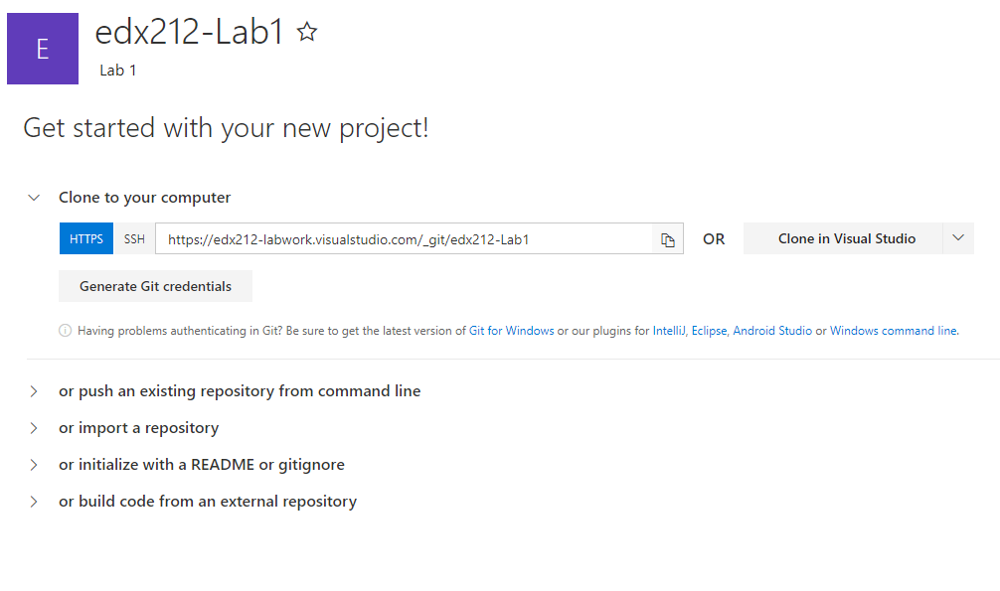

# edX DEV212x Intro to DevOps - LAB 3, Continuous Integration with Visual Studio Team Services #
This is the Hands on Lab for module 3 of the Intro to DevOps course.

Once you have completed the videos and other course material for Module 3, you can continue with this lab.

In this lab we have an application called PartsUnlimited. We want to set up
Visual Studio Team Services (VSTS) to be able continuously integrate code into the master
branch of code. This means that whenever code is committed and pushed to the
master branch, we want to ensure that it integrates into our code correctly to
get fast feedback. To do so, we are going to be setting up a Continuous Integration build (CI) that
will allow us to compile and run unit tests on our code every time a commit is
pushed to Visual Studio Team Services.

###Pre-requisites:###

-   Make sure you have completed [LAB 1](../Lab1/EdX212x-Lab1.md) to set up your VSTS account and install Git. 

### Tasks Overview: ###

**1. Import Source Code into your VSTS Account:** In this step, you will import from GitHub into your own Visual Studio Team Services account.

**2. Create Continuous Integration Build:** In this step, you will create a build definition that will be triggered every time a commit is pushed to your repository in Visual Studio Team Services. 

**3. Test the CI Trigger in Visual Studio Team Services:** In this step, test the Continuous Integration build (CI) build we created by changing code in the Parts Unlimited project with Visual Studio Team Services. 

# Get Started #

## 1: Import Source Code into your VSTS Account ##
If you are not at the project landing page, navigate to it.

   

Click on **> or import a repository** to expose the Import button and click it.

Copy in the URL of your source code (https://github.com/MicrosoftLearning/edX-DEV212x-Intro-to-DevOps).  If this were a repository that requried authorization clicking the box for authorization exposes the required fields.

Congratulations, your code is now in VSTS!  You will be redirected to the code / Files tab shortly.

### 2. Create Continuous Integration Build

A continuous integration build will give us the ability check whether the code
we checked in can compile and will successfully pass any automated tests that we
have created against it.

**1.** Since Visual Studio Team Services is already open in a browser, from the **Code** hub, click on the the **Build and Release** hub at the top of the page.

**2.** In the build hub, click on the **New definition** button to create a new build definition.

**3.** In the "Select a template" panel, select **.NET Desktop** as the template for the definition and then click next. If this is not visible, use the search box to search the templates.  Click on **Apply**.

**4.** After clicking the **Apply** button, give your build a more meaningful name. For this example, we will be using the [hosted agent](https://www.visualstudio.com/en-us/docs/build/admin/agents/hosted-pool) in Visual Studio Team Services. If you are using on-premises TFS at your organization, you will only be able to use on-premises agents (not hosted).  Select the **Hosted** option under Agent Queue.

**5.** Select the Get sources task.  The values should default to the VSTS repository and master branch, but please verify them.

**6.** Select the NuGet restore task. Leave the NuGet restore task as it is with the defaults. The NuGet packages will be restored for the solution in this step. 

**7.** On the **Build solution** task, leave the path to the solution as it is (will search for any solution files in the repository and there is only one). Enter the following information to the **MSBuild** Arguments. These arguments will create a Web Deploy (MSDeploy) package for PartsUnlimited into a single zip file in preparation for deployment in Lab 4 and place the package into the artifact staging directory of the agent. 
    
    /p:DeployOnBuild=true /p:WebPublishMethod=Package /p:PackageAsSingleFile=true /p:SkipInvalidConfigurations=true /p:PackageLocation=$(Build.ArtifactStagingDirectory)
      
> **Note:** Add all of the **MSBuild** parameters one after the other with spaces between them.

**8.** The rest of the tasks accomplish the following:
* Test Assemblies - Searches for automated test dlls in the compiled code after build and runs the tests locally.
* Publish symbols path - Publishes symbols (if specified) for debugging purposes.
* Copy Files - Copies build artifacts to the staging directory.
* Publish Artifact - Publishes build artifacts to a server.

**9.** You will now need to add an additional task to publish the ARMTemplates.  At the bottom of the task list click on **Add Task**.  Use the search bar to find Publish Build Artifacts.  Click on **Add** to add this task to the process.

**10.** You now need to tell this newly added task what to publish. Click on the **Publish artifact:** task and change the Path to Publish to be `src/env/PartsUnlimitedEnv/Templates`. Then, rename the Artifact Name to be "ARMTemplates." Since we're already publishing the PartsUnlimited zip file as a build artifact in the previous step, we will use this task instead to publish the Azure Resource Manager (ARM) templates for use in Lab 4.

**11.** Next, setup the Continuous Integration Trigger to build after pushes to master.  Click on the **Triggers** tab of the build definition. Enable the trigger.  The default values are okay for this exercise, but you can trigger on different branches or paths.

**12.** Click on the **Save** button to save the build definition. 

### 3. Test the CI Trigger in Visual Studio Team Services

We will now test the **Continuous Integration build (CI)** build we created in *Task 11* by changing code in the Parts Unlimited project with Visual Studio Team Services.

**1.** Click on the **Code** hub and then select your repo, such as "PartsUnlimited". Navigate to **src/src/PartsUnlimitedWebsite/Controllers/HomeController.cs** in the PartsUnlimited project, then click **Edit**.

**2.** After clicking **Edit**, add in a comment (e.g. `//comment`) to the top of the constuctor of the **HomeController.cs** file. Once complete, click **Save**. The Save button will actually commit the change on the master branch to the Git repo in VSTS and will automatically trigger a build.

**3.** Click the **Build** hub and note that a build has queued that was requested by your username. Click on the build number (such as "#20160920.1") to view the build's progress.

**4.** The console will show the log of the running build and should show that the build succeeded. If you click on the Build Number at the left panel, you can view the build summary as well. 

In this lab, you learned how to add an existing Git repo to a project in Visual Studio, create a Continuous Integration build definition to compile, test, and publish build artifacts, and the end-to-end workflow of committing code to master and automatically triggering a build. 

## Further Reading
1. [Release Management for Visual Studio Team Services](https://www.visualstudio.com/team-services/release-management/)
2. [Cloud Load Testing in Visual Studio Team Services](https://www.visualstudio.com/team-services/cloud-load-testing/)

The following are other PartsUnlimited Hands on Labs that you can try in your own time. **These are not required for the EdX course!**:

1. [User Telemetry with Application Insights - PartsUnlimited](https://github.com/Microsoft/PartsUnlimited/tree/master/docs/HOL_User_Telemetry_APM_With_App_Insights)
2. [Testing in Production with Azure Websites - PartsUnlimited](https://github.com/Microsoft/PartsUnlimited/tree/master/docs/HOL-HDD_Testing_in_Production)
3. [Usage analysis for web applications - PartsUnlimited](https://github.com/Microsoft/PartsUnlimited/tree/master/docs/HOL-Usage_Analysis_With_Application_Insights)
