# EdX DEV212x Intro to DevOps - LAB 5 #
This is the Hands on Lab for module 5 of the Intro to DevOps course.

> **NOTE:** VSTS is a rapidly evolving service, with releases coming every 3 weeks. Some of the images and instructions in this lab may change slightly so that they look different when you go through this lab. If you take a deep breath and think of the goal you're trying to achieve, you should be able to work out where to go even if the user interface does not exactly match the LAB.

## LAB 5 - Feedback & Monitoring with Visual Studio Team Services ##
Once you have completed the videos and other course material for Module 5, you can continue with this lab.

In this lab you have an application called PartsUnlimited, committed to a Git repo
in Visual Studio Team Services (VSTS) and a Continuous Integration build that builds the app and
runs unit tests whenever code is pushed to the master branch. Please refer to the
[LAB 3](../Lab3/EdX212x-Lab3.md) in order to see how the CI build was set up.

In [LAB 4](../Lab4/EdX212x-Lab4.md) the Release Management section built a continuous delivery pipeline triggering releases on successful builds.  The stages of development demonstrated gating, approvals, code promotion, and production deployment.

Now that the code is in the wild, it would be nice to profile your visitors to understand their website needs and effectiveness of the site.  App insights is deployed with the ARM template and provides just the information you need.

## Pre-requisites:

* You have completed [LAB 1](../Lab1/edX-DEV212x-Lab1.md)
* You have completed [LAB 3](../Lab3/edX-DEV212x-Lab3.md)
* You have completed [LAB 4](../Lab4/edX-DEV212x-Lab4.md)

* An active Azure account to host the PartsUnlimited Website as a Web App

## Tasks Overview:

1. See how Application Insights is setup in ARM Templates

1. View Data in Azure Portal

1. Query AppInsights and generate pie chart.

1. Create a new environment for A/B testing and direct traffic to the new slot

1. Modify code and see different versions of the site.

1. Review in AppInsights to see results


## Task 1: ##

* Navigate in your VSTS account to Files > PartsUnlimited > src > env > PartsUnlimitedEnv > Templates > AppInsights.json

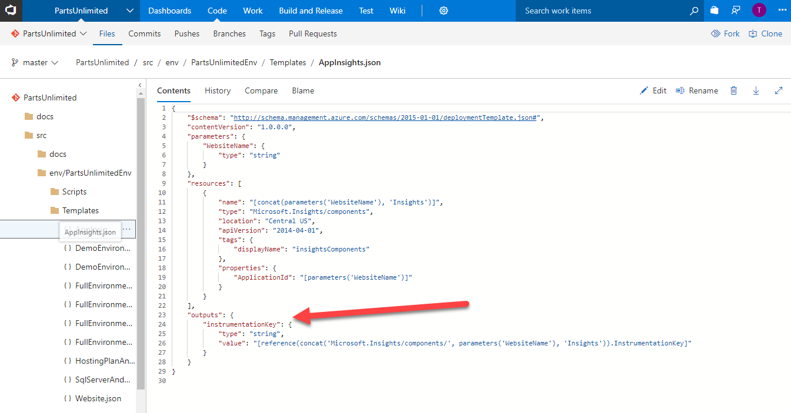

Note the output of the InstrumentationKey which is needed by the Web App.

Clicking on the Website.json file shows where the AppInsight key is integrated with the website

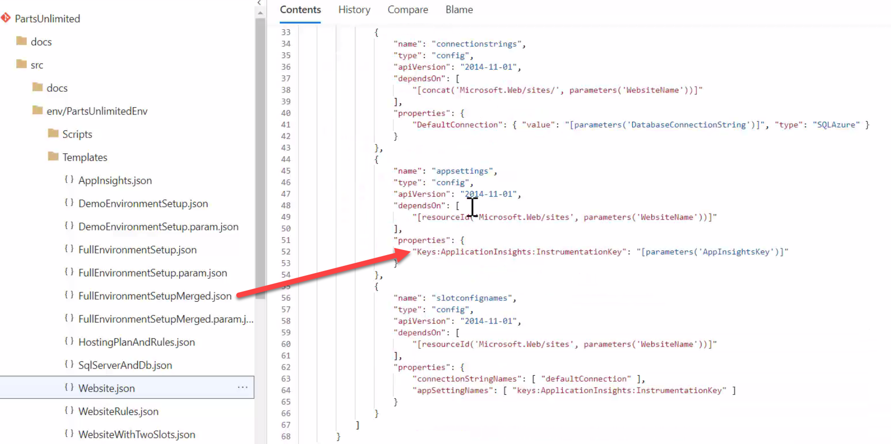

App Insights is already setup on the PartsUnlimited website, so please generate some data by clicking on the production website (from [LAB 4](../Lab4/edX-DEV212x-Lab4.md)). Specifically, click on the categories "Brakes", "Oil", "Lighting", etc.


## Task 2: ##

Let's go look at the data from the clicks.

* Log into the Azure Portal

If the dashboard doesn't have a link to your newly created Web App, Navigate to the App Insights Panel via Resource Groups > YourWebsiteName-DevInsights


## Task 3: ##

* Navigate to the AppInsight service for the production website.

Review the metrics available in App Insights. For the purposes of this lab we are interested in finding the number of clicks on each category of items in the store. Open the Analytics tab.


* Open a new query by clicking on the **+**.  This will help parse the data.

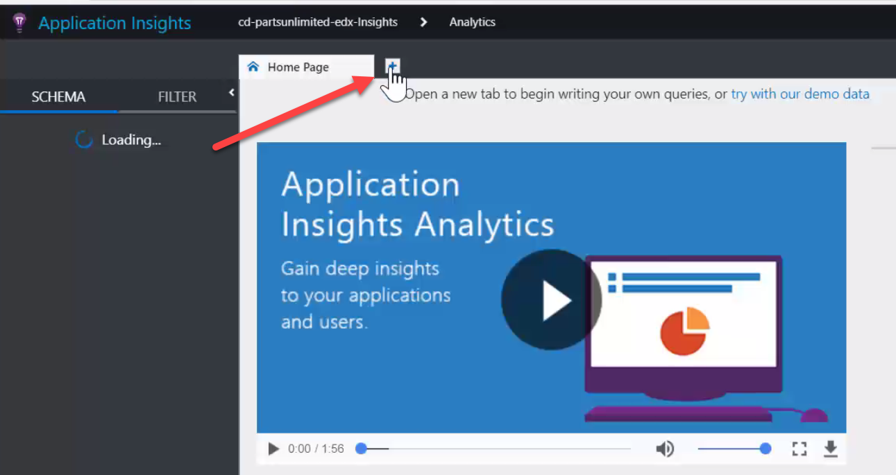

We are interested in requests to the website and will be using the request table.  In the query type:
```
requests
```

Press "Go" after each change to the query to execute it against the current data.

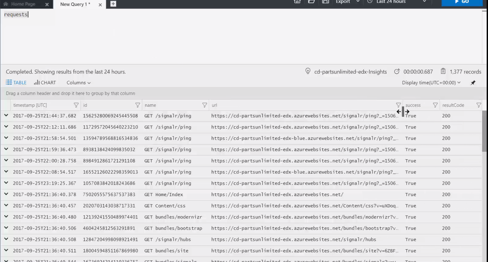

The URL is not in a format that is easily parsed.  Extend the requests table with a new column called parsedurl that uses the parseurl and tolower functions to make the data we are interested in easy to retrieve.
```
extend parsedurl = parseurl(tolower(url))
```

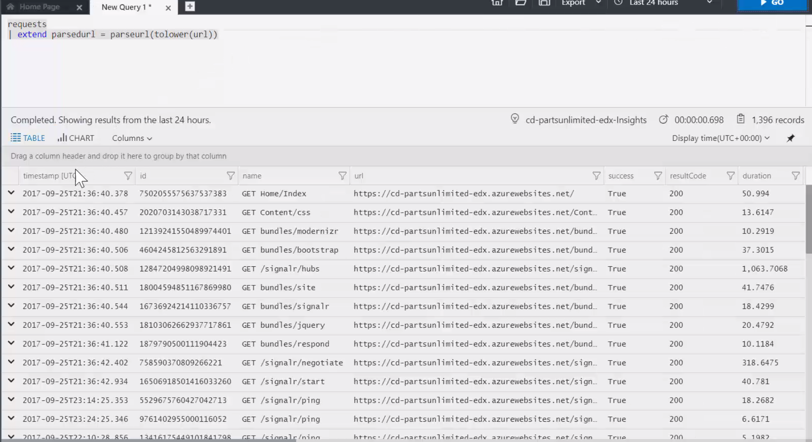

This provides every call made to the server, graphics, javascript, etc.  We aren't terribly interested in most of that information other than clicks to the store.  A filter on "/store/browse" fulfills the need and uses our parsedurl column we just generated.  Next, extract the category id from the query to get the specific category.

```
where parsedurl.Path == "/store/browse"
extend categoryid = toint(parsedurl["Query Parameters"].categoryid)
```


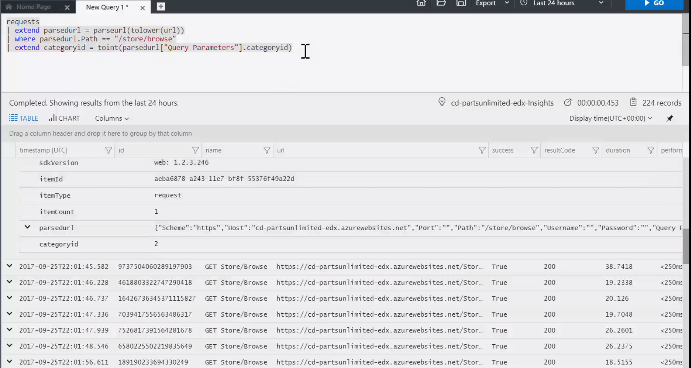

The category id is easy for a database engine to parse, but it is more clear to users if the categories are text related to the category. Add a datatable typed variable, before the query, with the conversion from category id to text.

```
let categories = datatable (categoryid:int, categoryname:string)
[ 1, "Brakes",
  2, "Lighting",
  3, "Wheels & Tires",
  4, "Batteries",
  5, "Oil"];
```

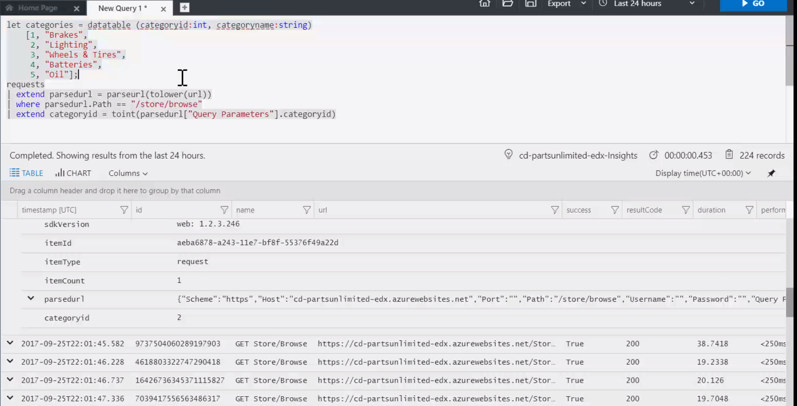

Now, join the conversion table with the requests from the website on categroryid.

```
join kind = inner (
    categories
) on categoryid
```

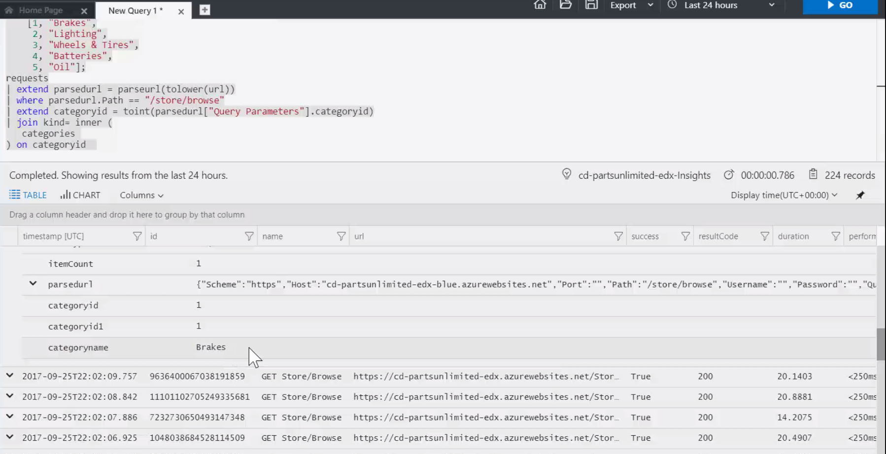

For this lab we are only interest in the time and category.  Output only these two columns from the join.

```
project timestamp, category=categoryname
```

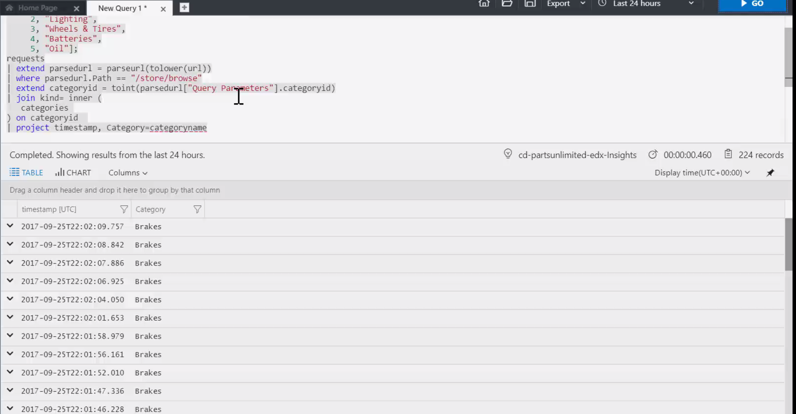

Summarize the data by creating a count of category data and create a piechart to visualize the data.

```
summarize count() by category
render piechart
```

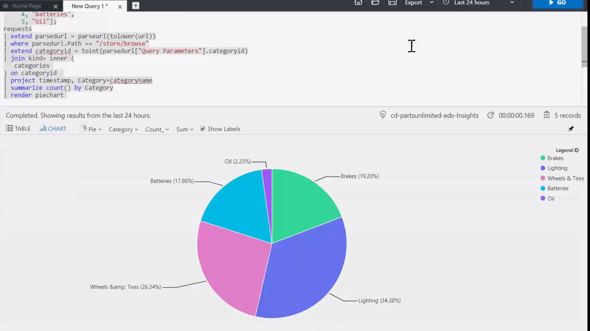

## Task 4: ##

With the ability to view metrics about the site, we can now create two versions to compare effectiveness of a change, to beta test a new idea, or to troubleshoot a problem.  For this lab we notice that few customers are interested in our Oil at a 10% discount and hypothesize that a 15% discount may incent them to purchase.

Log into your VSTS account and navigate to the Release Definition for PartsUnlimited.  Edit the PartsUnlimited definition.

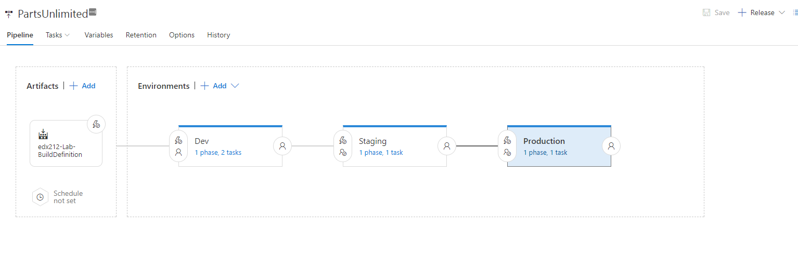

Rename the production environment to differentiate it from our main production.

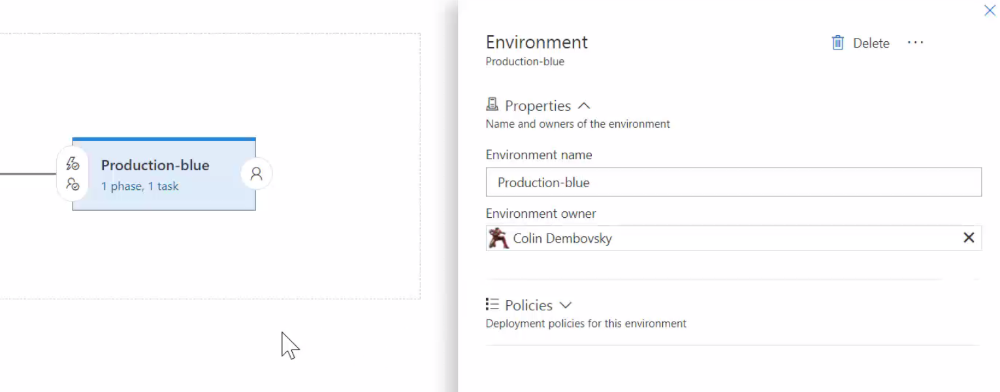

Deploy code to the blue slot by enabling "Deploy to slot" and providing a slot identifier.

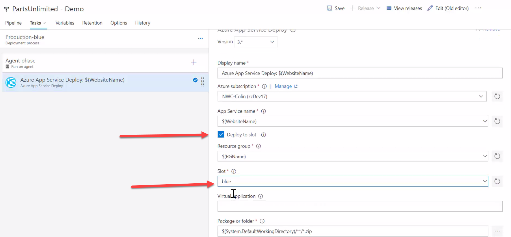

Add Route Traffic task to divert traffic to the blue slot.

If the Route Traffic Task does not appear in your search, please install this extension from the market place [](https://marketplace.visualstudio.com/items?itemName=colinsalmcorner.colinsalmcorner-buildtasks)


Use variables defined in the release to configure the traffic manager.

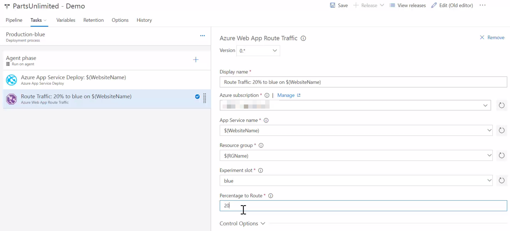

Clone a new environment for the experimental change being successfull.


If blue fails, don't change production, but remove the traffic being sent to that slot.

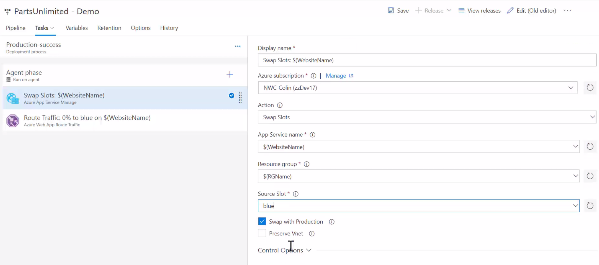

## Task 5: ##

Modify code to increase the Oil discount to 15% (HomeController) and deploy to blue slot just as demonstrated in Lab 3 & Lab 4.  With the continuous integration and continuous deployment pipelines built this should be an straightforward task.

Open website to see differences.  Use a header of x-ms-blue to see override the route traffic to the blue slot.

## Task 6: ##

Review in app insights.