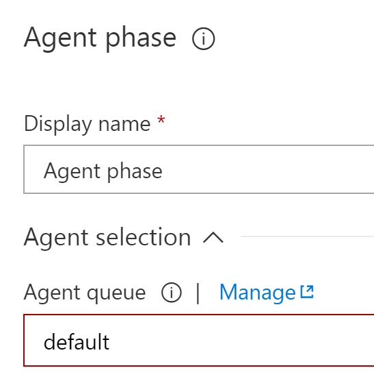
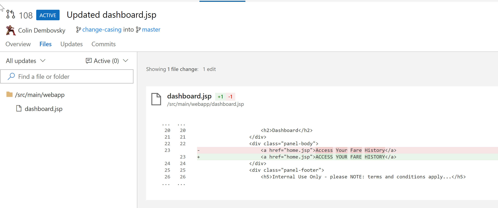

# EdX DEV212x Intro to DevOps - LAB 5 Linux #
This is the Linux Hands on Lab for module 5 of the Intro to DevOps course.

> **NOTE:** VSTS is a rapidly evolving service, with releases coming every 3 weeks. Some of the images and instructions in this lab may change slightly so that they look different when you go through this lab. If you take a deep breath and think of the goal you're trying to achieve, you should be able to work out where to go even if the user interface does not exactly match the LAB.

## LAB 5 - A/B Testing, Feedback & Monitoring with Visual Studio Team Services ##
Once you have completed the videos and other course material for Module 5, you can continue with this lab.

In this lab you have an application called MyShuttle2, committed to a Git repo
in Visual Studio Team Services (VSTS) and a Continuous Integration build that builds the app, runs
unit tests and publishes a container image to a container registry whenever code is pushed to the master branch. Please refer to the
[LAB 3](../Lab3/EdX212x-Lab3-linux.md) in order to see how the CI build was set up.

In [LAB 4](../Lab4/EdX212x-Lab4-linux.md) the Release Management section built a continuous delivery pipeline triggering releases on successful builds - though there was only a single environment (the Azure Linux VM itself).

At this point you're ready to deploy your container somewhere that customers can hit the site. Once deployed, you'll want to profile the application to understand you customer's needs as well as the effectiveness of the site. Application Insights can provides just this sort of information. Now you can deploy new versions of the application to a staging slot and divert a percentage of traffic to the slot. Then you can monitor the slot and the production site to determine if the new version is "better" than the current production version - where "better" may mean better performance, more clicks, better conversion rates or anything else that you may need to experiment with.

## Pre-requisites:

* You have completed [LAB 1](../Lab1/edX-DEV212x-Lab1-linux.md)
* You have completed [LAB 3](../Lab3/edX-DEV212x-Lab3-linux.md)
* You have completed [LAB 4](../Lab4/edX-DEV212x-Lab4-linux.md)

* An active Azure account to host the MyShuttle Website as a Web App for Containers

## Tasks Overview:

1. See how the site and its slot, database and Application Insights are conifgured in the ARM Templates

1. Create a link from VSTS to your Azure subscription

1. Modify the Release Definition to deploy the MyShuttle container to Azure, including deploying to a staging slot and diverting a percentage of traffic to the slot

1. Modify code and see different versions of the site

1. Review in AppInsights to see results

## Task 1: Explore the ARM Template in the Repository ##

Before you deploy the application to Azure, we will take a look at the Azure Resource Manager (ARM) template to understand how which resources are going to be deployed and how they are connected.

1. Navigate in your VSTS account to the Code hub. Click on the MyShuttle2 repo and browse the Files to MyShuttle2/env/azuredeploy.json.

    

    There are several resources that are configured in this template:
    * The `Microsoft.Web/sites` resource is the Web App for Containers resource. Notice how the `appSettings` include keys for the Docker Registry Container as well as the name of the image to run
    * The site also deploys a `slots` resource which creates a staging slot for the site. Notice how the slot has its own `appSettings` too
    * There are two  `Microsoft.Insights/components` resources (these are Application Insights resources) - one for the production slot (the main site) and one for the staging slot
    * The site and the slot both have has a setting called `APPLICATION_INSIGHTS_IKEY` which looks up the corresponding `Microsoft.Insights/components` in order to set the key correctly for the Application Insights component that runs in the Java application inside the container.
    * The site is deployed onto an application plan (the `Microsoft.Web/serverfarms` resource) which has its `kind` attribute set to `linux` which tells Azure that the web app(s) on this plan are going to be containers.
    * There is a `Microsoft.DBforMySQL/servers` which deploys a MySQL resource to host the database

## Task 2: Create a Service Link from Visual Studio Team Services to an Azure Account ##

In order to interact with Azure, you'll need to create a Service Endpoint in VSTS. This Endpoint includes the authentication information required to deploy to Azure.

> **Note**: Deploying [ARM Templates](https://azure.microsoft.com/en-us/documentation/articles/resource-group-authoring-templates/)
to Azure from Release Management requires a [Service Principal](http://blogs.msdn.com/b/visualstudioalm/archive/2015/10/04/automating-azure-resource-group-deployment-using-a-service-principal-in-visual-studio-online-build-release-management.aspx).

When you create a new Service Endpoint in VSTS, a wizard pops up. The wizard has two "modes": automatic or manual. This lab will walk through the manual method - however, you should first attempt the **automatic** method.
    


> **PowerShell Script** if you do not see any subscriptions, then you will have to click on the [link](https://www.visualstudio.com/en-us/docs/release/author-release-definition/understanding-tasks#azure-resource-manager-service-endpoint) provided in the dialog and follow the instructions. The link will have a PowerShell script that you will download. The script will output several pieces of information which you will fill in on corresponding fields in the wizard.

1. Create an Azure Service Endpoint in Visual Studio Team Services
	1. Log in to your VSTS account.
	1. Open the project administration page by clicking the gear icon in the upper right.
	
		

	1. Click on the Services tab
	
		
	1. Click on "New Service Endpoint" and select "Azure Resource Manager" from the list

	1. First attempt to click the link for creating the connection automatically.

	> **Note**: Automatic only works if you are signed into VSTS using an account that is linked to an Azure subscription in the Azure Portal. The wizard will prompt you to select the Azure Susbscription and then automatically create the Service Principal. If this works, skip to the next task.
	
	1. If you do not see any subscriptions listed in the Automatic dialog, then click on the link to create the Service Principal manually. Download the PowerShell script and run it. When the script completes, it will give you values for all the fields in the Wizard.

		
	
	1. When you have filled in the fields, click "Verify connection" to verify the connection. Click OK to close the dialog.
	
		

	1. You should see a new Service Endpoint in the list of endpoints on the left of the Endpoints page. You can close the project administration page.

		

## Task 3: ##

At this point we have two container images: `web` which contains the web app and runs it on Tomcat and `db` which is a mysql container. We're going to configure the application to deploy the web app container image to Azure Web Apps for Containers and rather than deploy another container for the database we'll create an Azure MySql database. The ARM template we looked at in Task 1 specify how Azure is to deploy these resources. In this task you'll configure a Release Definition in VSTS that will deploy the resources to Azure using the ARM template, deploy the database schema and some test data to the MySql database and configure the correct container image onto each slot in the web app. You'll also configure a Traffic Manager rule that will divert a percentage of the traffic to the staging slot - this is how to perform A/B testing.

1. Log into your VSTS account and browse to the Release hub. Open the Release Definition you created in Lab 4 (it should be called `MyShuttle2 - CD` or something similar). It should have a single environment called `AzureVM` that runs the containers from the triggering build in the Azure VM.

1. Click the `+ Add` button on the Artifacts block to add a new artifact. Set the properties as follows:

    | Parameter | Value | Notes |
    | --------------- | ---------------------------- | ----------------------------------------------------------- |
    | Source type | Git | We want to clone the source code - specifically for the deployment scripts and templates | 
    | Project | The name of your Team Project | The team project that contains the repo to clone | 
    | Source (repository) | `MyShuttle2` | The name of the repo to clone |
    | Default branch | `master` | The branch to clone |
    | Shallow fetch depth | 1 | We just need the latest commit in the repo - not the entire history |
    | Source alia | `Source` | The folder name that the repo will be cloned into |

    

1. Add a new environment to the definition. This environment represents deployments to the staging slot (which you'll name `blue`).

    1. Click the `+ Add` button on the Environments block and add a new environment. Click the "Empty process" link to create an empty environment.

        

    1. Change the name of the environment to `PROD-blue`. 

        

    1. Click on the Pre-deployment conditions block of the new environment. Make sure that the trigger is set to deploy automatically after a successful deployment to the `AzureVM` environment:

        

    1. Click on "Pre-deployment approvers" and set yourself as a predeployment approver:

        

1. Configure the tasks for the `PROD-blue` environment.

    > **Note**: The tasks for this environment will deploy the resources to Azure that we need for the site, its plan and staging slot, the Azure MySql database and the Application Insights components. It will then set the container image for the staging slot to deploy, configure and run integration tests against the site as well as publish the test results.

    1. Click on the "Agent Phase" row and change the Queue to "default" so that your private agent executes the release tasks for this phase of the release.

        
    
    1. Click the "+" icon on the phase to add a new task. Type "resource" in the search box. Add an "Azure Resource Group Deployment" task. This task will deploy the resources that are required to run the site and the database in Azure. Set the following properties for the task:

        | Parameter | Value | Notes |
        | --------------- | ---------------------------- | ----------------------------------------------------------- |
        | Azure subscription | Select the Azure subscription endpoint that you created earlier. | This configures authentication for the deployment.  |
        | Action | Create or update resource group | We are creating or updating a resource group in Azure |
        | Resource Group | `$(RGName)` | The name of the resource group to create/update. We're setting it to the value of a variable called `RGName` which we'll define shortly |
        | Location | Select an Azure datacenter | The Azure datacenter to deploy the resource group and its resources to |
        | Template Location | Linked Artifact | The ARM template is an artifact that is linked to the release |
        | Template | `$(System.DefaultWorkingDirectory)/Source/env/azure-deploy.json` | You can type this or browse to it using the elipses (...) button - this is the ARM template we want VSTS to deploy |
        | Template Parameters | `$(System.DefaultWorkingDirectory)/Source/env/azure-deploy.parameters.json` | You can type this or browse to it using the elipses (...) button - this is path to the parameter settings file |
        | Override template parameters | Click on the elipses (...) and set the values according to the table below | This sets the values for the parameters |

        

        Set the "Override template parameters" as follows (each `$()` means a variable)

        | Parameter | Value | Notes |
        | --------------- | ---------------------------- | ----------------------------------------------------------- |
        | siteName | `$(SiteName)` | The name of the web app. It will need to be globally unique - Azure will create the site DNS as `$(SiteName)`.azurewebsites.net |
        | administratorLogin | `$(MySqlAdminLogin)` | The name of the admin user for the MySql database |
        | administratorLoginPassword | `$(MySqlAdminPassword)` | The password of the admin user for the MySql database |
        | databaseDTU | `50` | The DTU settings for the database |
        | databaseSkuName | `MYSQLB50` | The SKU for the database |
        | databaseSkuSizeMB | `51200` | The SKU size for the database |
        | databaseSkuTier | `Basic` | The SKU tier for the database |
        | mysqlVersion | `5.7` | The MySql version for the database |
        | registryName | `$(RegistryName)` | The name of the Azure Container Registry to find the container images |
        | registryResourceGroup | `$(RegistryRGName)` | The resource group that contains the Azure container registry |
        | dockerImagePort | `8080` | The port of the web image to map to port 80 of the Azure web app |
        | dockerImageName | `web` | The name of the container image to deploy |
        | dockerImageTag | `$(Tag)` | The tag for the container image to deploy |
        | slotName | `blue` | The name of the staging slot on the Web app |

    1. Click the "+" icon on the phase to add a new task. Type "shell" in the search box. Add a "Shell Script" task. This task will excute a mysql command against the mysql database created in the previous task to create the database schema and insert some test data. Set the following properties for the task:

        | Parameter | Value | Notes |
        | --------------- | ---------------------------- | ----------------------------------------------------------- |
        | Script path | `$(System.DefaultWorkingDirectory)/Source/src/db/deploySchema.sh` | You can type this or browse to it using the elipses (...) button - this is the shell script we want VSTS to execute to populate the database with test data. |
        | Arguments | `"$(SiteName)-mysqlserver" $(MySqlAdminLogin) $(MySqlAdminPassword) ./schema.sql` | The arguments to pass into the script: the name of the Azure MySql server, the admin credentials and the name of the SQL file to execute |
        | Specify Working Directory | Checked | Use a non-default working directory | 
        | Working Directory | `$(System.DefaultWorkingDirectory)/Source/src/db` | The working directory for the execution of the script |

        

    1. Click the "+" icon on the phase to add a new task. Type "cli" in the search box. Add an "Azure CLI" task. This task will excute an Azure CLI command to set the image name and tag that we want to deploy to the staging (blue) slot. Set the following properties for the task:

        | Parameter | Value | Notes |
        | --------------- | ---------------------------- | ----------------------------------------------------------- |
        | Version | `1.*` | To specify inline scripts, we need version 1.* of the task |
        | Azure subscription | Select the Azure subscription endpoint that you created earlier. | This configures authentication for the deployment.  |
        | Inline script | (See code snippet below) | The script to execute |
        | Arguments | `$(SiteName) blue $(RGName) "$(RegistryName).azurecr.io/web:$(Build.BuildNumber)"` | The arguments to pass into the script: the name of the site, the slot name, the name of the resource group and the fully qualified name of the container image to deploy |

        The inline script should be set to:

        ```bash
        # pause for a bit to let the service catch up
        sleep 30s

        # set the image
        az webapp config container set -n $1 -s $2 -g $3 -c $4
        ```

        The script pauses for a few seconds to give the container time to start up. 30s is a conservative number - but since this is a staging slot, this pause will not affect the production site so we can afford to be conservative. It then uses `az` (the Azure CLI) to set the container image name for the specified slot.

        

    1. Click the "+" icon on the phase to add a new task. Type "replace" in the search box. Add a "Replace Tokens" task. Set the following properties for task:

        | Parameter | Value | Notes |
        | --------------- | ---------------------------- | ----------------------------------------------------------- |
        | Source Path | `$(System.DefaultWorkingDirectory)/MyShuttle2/drop` | The path in which to search for tokenized files |
        | Target File Pattern | `*.release.*` | The file pattern to use to find tokenized files in the Source Path |

        

        > **Note**: This task is replacing tokens inside the `testng.release.xml` file - specifically the baseUrl for the test task (which you'll define next).

    1. Click the "+" icon on the phase to add a new task. Type "command" in the search box. Add a "Command Line" task. Set the following properties for the task:

        | Parameter | Value | Notes |
        | --------------- | ---------------------------- | ----------------------------------------------------------- |
        | Tool | `java` | Invoke java |
        | Arguments | `-cp myshuttledev-tests.jar:test-jars/* org.testng.TestNG ../testng.release.xml` | Arguments for the java command to invoke the integration tests |
        | Advanced/Working folder | `$(System.DefaultWorkingDirectory)/MyShuttle2/drop/target` | Run the command in the correct folder |

        

        > **Note**: This command invokes Java to run testNG tests. The run uses the `testng.release.xml` file which at this point in the release contains the correct `baseUrl` for the tests. If the tests fail, the release will fail.

    1. Click the "+" icon on the phase to add a new task. Type "publish test" in the search box. Add a "Publish Test Results" task. Set the following properties for the task:
    
        | Parameter | Value | Notes |
        | --------------- | ---------------------------- | ----------------------------------------------------------- |
        | Test results files | `**/TEST-*.xml` | Invoke java |
        | Control Options/Continue on error | Checked | Uploads the results even if the tests from the previous step fail. |

        

        > **Note**: This command grabs the JUnit test results file from the test run and publishes them to the release so that the test results are available in the Release summary.

    1. Click the "+" icon on the phase to add a new task. Type "traffic" in the search box. Add an "Azure Web App Route Traffic" task. Set the following properties for the task:
    
        | Parameter | Value | Notes |
        | --------------- | ---------------------------- | ----------------------------------------------------------- |
        | Azure subscription | Select the Azure subscription endpoint that you created earlier. | This configures authentication for the deployment.  |
        | App Service Name | `$(SiteName)` | The name of the app service |
        | Resource Group | `$(RGName)` | The name of the resource group the site is in |
        | Experiment slot | `blue` | The name of the slot to route traffic to |
        | Percentage to Route | `20` | The percentage of traffic to route to the staging slot |

        

        > **Note**: This task will set up a Traffic Manager rule that routes 20% of traffic directed at the _production_ slot (in other words the main site) to the blue slot. Users will not need to change their URL - Traffic Manager does this under the hood. This lets us test the new version of the app with a small subset of users to determine if this is a successful experiment or not.

    1. The tasks in the environment should look something like this:

        

    1. Save the definition so that you don't lose any of your work!

    1. Click on Pipeline to return to the main pipeline view. Click on The `PROD-blue` environment to select it. Click on the "Post-deployment conditions" icon and set yourself as a post-approver.

        

1. With the `PROD-blue` environment selected, click on the `+ Add` button to add another environment. Use the "Empty process" link and set the name of the environment to `PROD`: it should be to the right of the `PROD-blue` environment. Set the trigger to be "After successful deployment to `PROD-blue` and set yourself as a pre-approver.

    > **Note**: This environment will be executed if the experiment is a success. In this case, we want to swap the blue slot to the production slot (this is instantaneous as Azure performs a Virtual IP - or VIP - swap under the hood) so there is zero downtime for our users. We also then want to reset the Traffic Manager so that 0% traffic is routed to the blue slot - in other words, now all traffic to the main site will go to the production slot.

    1. Click the "+" icon on the phase to add a new task. Type "manage" in the search box. Add an "Azure App Service Manager" task. Set the following properties for the task:
    
        | Parameter | Value | Notes |
        | --------------- | ---------------------------- | ----------------------------------------------------------- |
        | Azure subscription | Select the Azure subscription endpoint that you created earlier. | This configures authentication for the deployment.  |
        | Action | `Swap Slots` | The action to perform |
        | App Service Name | `$(SiteName)` | The name of the app service |
        | Resource Group | `$(RGName)` | The name of the resource group the site is in |
        | Experiment slot | `blue` | The name of the source slot to swap |
        | Swap with production | Checked | We want to swap the source slot with the production slot |

        

    1. Click the "+" icon on the phase to add a new task. Type "traffic" in the search box. Add an "Azure Web App Route Traffic" task. Set the following properties for the task:
    
        | Parameter | Value | Notes |
        | --------------- | ---------------------------- | ----------------------------------------------------------- |
        | Azure subscription | Select the Azure subscription endpoint that you created earlier. | This configures authentication for the deployment.  |
        | App Service Name | `$(SiteName)` | The name of the app service |
        | Resource Group | `$(RGName)` | The name of the resource group the site is in |
        | Experiment slot | `blue` | The name of the slot to route traffic to |
        | Percentage to Route | `0` | The percentage of traffic to route to the staging slot |

        

    1. The tasks in the environment should look something like this:

        

1. Click on pipeline to return to the pipeline view. With no environment selected, click on the `+ Add` button to add another environment. Use the "Empty process" link and set the name of the environment to `blue-failed`. The trigger will be set to "After release" but you should change it to be Manual.

    

    > **Note**: This environment will be executed if the experiment is a failure - and in this case it will have to be manually invoked. In the event of a failed experiment, we do _not_ want to swap the blue slot to the production slot. We do, however, want to reset the Traffic Manager so that 0% traffic is routed to the blue slot - in other words, now all traffic to the main site will go to the production slot. The production slot will remain on the previous (current) version of the application.

    1. Click the "+" icon on the phase to add a new task. Type "traffic" in the search box. Add an "Azure Web App Route Traffic" task. Set the following properties for the task:
    
        | Parameter | Value | Notes |
        | --------------- | ---------------------------- | ----------------------------------------------------------- |
        | Azure subscription | Select the Azure subscription endpoint that you created earlier. | This configures authentication for the deployment.  |
        | App Service Name | `$(SiteName)` | The name of the app service |
        | Resource Group | `$(RGName)` | The name of the resource group the site is in |
        | Experiment slot | `blue` | The name of the slot to route traffic to |
        | Percentage to Route | `0` | The percentage of traffic to route to the staging slot |

        

1. The final pipeline should look something like this:

    

1. Click on Variables to set the missing variables. Set the values as follows:

    | Name | Value | Scope | Notes |
    | ------ | ------ | ---- | ----------------------------------------------------------- |
    | baseUrl | `http://10.0.0.4:8081/myshuttledev/` | `AzureVM` | The baseUrl for the tests in the AzureVM environment. This should already exist - you're just updating the scope. |
    | baseUrl | `http://$(SiteName)-blue.azurewebsites.net/myshuttledev/` | `PROD-blue` | The baseUrl for the tests in the PROD-blue environment |
    | MySqlAdminLogin | `mysqlroot` | `Release` | The admin username for the MySql database |
    | MySqlAdminPassword | Some password | `Release` | The admin password for the MySql database: padlocked to make it a secret |
    | RegistryName | The name of your Azure Container Registry (ACR) | `Release` | The container registry |
    | RegistryRGName | The name of your Azure resource group where the ACR is deployed | `Release` | The resource group for the container registry |
    | RGName | The name of the Resource Group to create | `Release` | |
    | SiteName | The name of the Azure Web App to create  | `Release` | This is for the DNS entry: the full site name will the _SiteName_.azurewebsites.net |
    
    The variables should look something like this:

    

1. Save the definition - you're now ready to run it! Run the release by clicking `+ Release -> Create Release` in the toolbar. In the dialog, select the latest build and the first (latest) commit for the Git artifact:

    

1. The release will run for the AzureVM environment. A green bar will appear with the name of the releast - click it to open the release summary page. Once that environment succeeds, it will automatically trigger the release to the `PROD-blue` environment - which starts with a predeployment approval. Click on the "Approve or Reject" link on the yellow bar and then click the Approve button:

    

    > **Note**: The first time this runs, it will be creating new Azure resources and may take a few minutes. Subsequent runs will be faster since the resources will already exist.

1. Once the deployment to `PROD-blue` has succeeded, you can click on the Tests tab to view the tests that have run. You can also browse to `http://SiteName-blue.azurewebsites.net` (where SiteName is the value you specified for the SiteName variable in the Release) to make sure that the site is up and running. Of course it will be - since the tests should have passed by this point in time!

1. At this point, the site is running on the blue slot, but not yet in production. To deploy to production, we need to approve the post-deployment on the `PROD-blue` environment to swap the slots. But then the blue slot will be empty (since we're swapping it with the empty production slot)! Once the `PROD` environment has successfully deployed, click the `Deploy` button in the toolbar of the release summary and deploy (again) to `PROD-blue`. VSTS warns us that the build is already deployed to the environment, but we're going to hit Deploy anyway!

    

Don't forget to approve the pre-deployment approval! At this point there should be a running site in both the blue slot as well as the production slot. 

1. Verify this by browsing to the production URL of your site (so if your `SiteName` variable was "myshuttlelinuxapp2" you would browse to http://myshuttlelinuxapp2.azurewebsites.net/myshuttledev/). You can also browse to the blue slot by browsing to http://`SiteName`-blue.azurewebsites.net/myshuttledev/.

    

> **Note**: You can log in by entering in `fred` for the username and `fredpassword` for the password.

## Task 4: ##

In this task you will make a change to the code. We're going to change the look and feel of a link to see if more users click on it. This example is a little contrived, but the point is to show that we can create an experiment, quickly deploy it and since we have A/B testing configured, measure the effectiveness of the code change.

1. Log a User Story in VSTS to track the experiment. Log in to your VSTS account and browse to the Team Project that you've been working from. Click on Work to open the Work hub. Click on the Stories backlog and click the Backlog link to open it. Enter "Change casing of Access Fare link" and click Add.

    

1. Assign the work item to yourself. Click on the work item title to open its form. Select your name in the Assigned To field.

    

1. Create a branch for the story in IntelliJ. Open the MyShuttle2 project in IntelliJ. Press "Alt-9" or click View->Tool Windows->Version Control to open the version control pane. Click work items to see the work items assigned to you. Right click the work item that you created earlier and click "Create a branch..."

    

1. Rename the branch to "casing-change" and click create. Note how IntelliJ notifies us that a new branch has been created and that the work item has been associated to the branch.

    

1. Find the `src/main/webapp/dashboard.jsp` file. Change the link to all uppercase and save the file.

    

1. Press "Cntrl-K" or click VCS->Commit. Enter a commit message like "Changing case" and use the fly-out from the Commit button to select "Commit and Push". Click on the Push button when the Push dialog appears.

    

1. Click on the Pull Requests tab in the Source Control pane. Click the + button to create a new Pull Reqest. The dialog should default to creating a Pull Request from the "casing-change" branch into the master branch. Click "Create Pull Request". IntelliJ notifies us that a PR has been created and it should be listed in the Pull Requests tab.

    

1. Approve the PR. Open VSTS in a browser and navigate to the Code hub and click on Pull Requests. Locate the Pull Request that you created from IntelliJ and click on it. Note the linked work item.

1. Click on Files to review the changes. A code reviewer could review the changes at this point.

    

1. Click on Approve to approve the changes. Then click on "Complete" button. Accept the defaults and click Complete. This will trigger a build which will in turn trigger a release. Wait until the release requests approval for the PROD-blue environment and approve it.

    

    

1. Once the deployment to PROD-blue has completed, browse to the blue slot URL of your site (so if your `SiteName` variable was "myshuttlelinuxapp2" you would browse to http://myshuttlelinuxapp2-blue.azurewebsites.net/myshuttledev/). Log in and check that the Access Fare link is changed. You can also check that the production slot (the main site URL) remains unchanged. If it does look changed, remember that you might have been redirected to the blue slot by the traffic manager rule!

1. You can force traffic manager to route you to one or other slot. Start by browsing to the production slot (i.e. http://`SiteName`.azurewebsites.net/myshuttledev/.) Now add `?x-ms-routing-name=blue` to the URL. Log in and verify that you're seeing the change. To revert back to the production slot by changin the query string to `?x-ms-routing-name=production`. Again log in and verify that you're getting the unchanged code.


## Task 5: ##