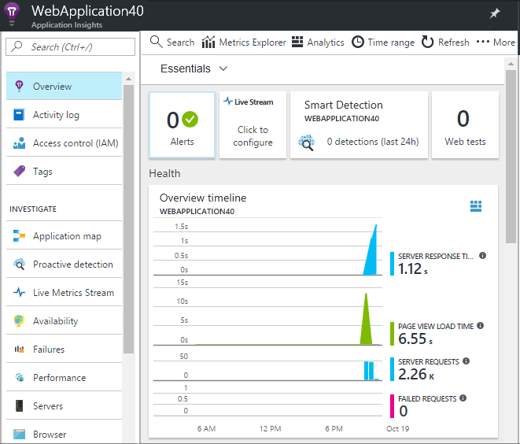

# EdX DEV212x Intro to DevOps - LAB 5 #
This is the Hands on Lab for module 5 of the Intro to DevOps course.

> **NOTE:** VSTS is a rapidly evolving service, with releases coming every 3 weeks. Some of the images and instructions in this lab may change slightly so that they look different when you go through this lab. If you take a deep breath and think of the goal you're trying to achieve, you should be able to work out where to go even if the user interface does not exactly match the LAB.

## LAB 5 - Feedback & Monitoring with Visual Studio Team Services ##
Once you have completed the videos and other course material for Module 5, you can continue with this lab.

In this lab you have an application called PartsUnlimited, committed to a Git repo
in Visual Studio Team Services (VSTS) and a Continuous Integration build that builds the app and
runs unit tests whenever code is pushed to the master branch. Please refer to the
[LAB 3](../Lab3/EdX212x-Lab3.md) in order to see how the CI build was set up.

In [LAB 4](../Lab4/EdX212x-Lab4.md) the Release Management section built a continuous delivery pipeline triggering releases on successful builds.  The stages of development demonstrated gating, approvals, code promotion, and production deployment.

Now that the code is in the wild, it would be nice to profile your visitors to understand their website needs and effectiveness of the site.  App insights is deployed with the ARM template and provides just the information you need.

## Pre-requisites:

* You have completed [LAB 1](../Lab1/edX-DEV212x-Lab1.md)
* You have completed [LAB 3](../Lab3/edX-DEV212x-Lab3.md)
* You have completed [LAB 4](../Lab4/edX-DEV212x-Lab4.md)

* An active Azure account to host the PartsUnlimited Website as a Web App

## Tasks Overview:

1. Verify the Application Insights is collecting data from the website.

1. Review of data collected.

1. Use the 'Testing in Production Feature' to split off a portion of the traffic to the staging slot to A/B test a feature. 

## Task 1: ##
* Log into the Azure Portal

If the dashboard doesn't have a link to your newly created Web App, Navigate to the App Insights Panel via Resource Groups > YourWebsiteName-DevInsights

## Task 2: ##

## Task 3: ##

* Navigate to the App Service running the website.

* After selecting the App Service scroll down in the left blade until the **Development Tools** section appears.  Select the **Testing in Production** option.

* In the Testing in Production window select from the dropdown of defined slots.  Add or change the percentage of traffic allocated to each slot.  Higher percentage will make this easier to verify, but typically a feature would start with a low percentage and increase until it made sense to switch the staging and production.  The balance of traffic will be sent to the production slot.  Click save to activate the changes.

