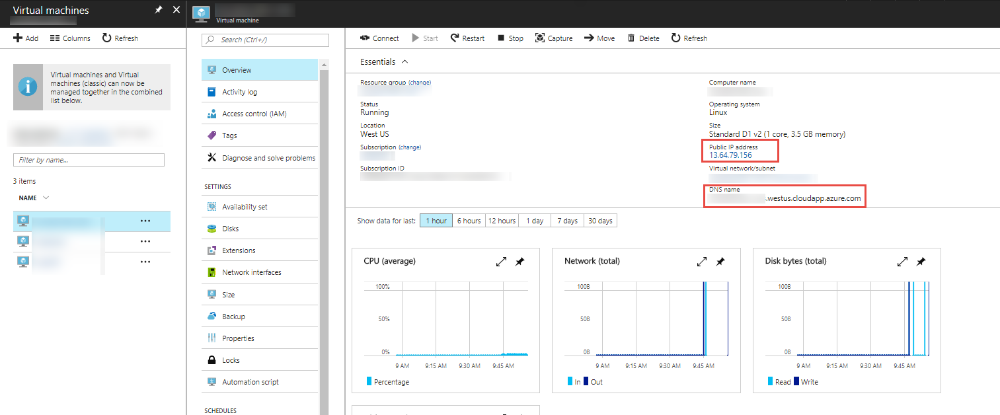
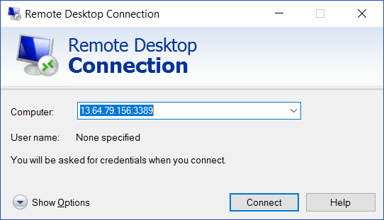
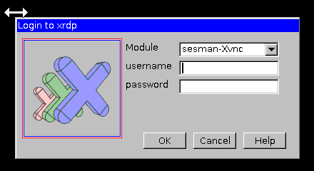

# EdX Intro to DevOps #
Welcome to the Hands on Labs repository for the [edX DEV212x Intro to DevOps course (Module 1)](https://www.edx.org/course/introduction-devops-microsoft-dev212x-0).
This repo contains all the source code and Hands on Lab manuals for the course.

## The LABs ##
Please review the course material and videos before returning to this repository to do the LABs.

## Java Lab Setup ##

These hands on labs allow you to explore how VSTS works in a Linux environment with [Visual Studio Team Services (VSTS)](https://www.visualstudio.com/en-us/products/visual-studio-team-services-vs.aspx), [IntelliJ](https://www.jetbrains.com/idea/) and [Team Explorer Everywhere](https://www.visualstudio.com/en-us/products/team-explorer-everywhere-vs.aspx). This combination of tools and technologies allows you to leverage the Microsoft DevOps platform for Java development. 

The java labs use an Azure Resource Management (ARM) template to dynamically spin up a virtual machine in a selected Azure subscription with the latest versions of the software used in the labs. 

If you require assistance with these labs, contact Northwest Cadence through our [website](http://nwcadence.com).

There are a couple of tasks needed to setup the environment before starting the labs.

## Task 1: Provision the VM and Dependent Resources

1. Create the VM and dependent resources.
    
    Simply click the Deploy to Azure button below and follow the wizard to create the resources. You will need to log in to the Azure Portal.
                                                                     
	
	

    The resources will be deployed to a Resource Group. You can delete the resource group in order to remove all the created resources at any time.

	The VM will take a few minutes (~20) to complete. The VM is installing required software and configuring the environment for the labs.

## Task 2: Connect to the VM
Once the VM has been provisioned, remote desktop to the machine and log in.

1. Get the IP address/DNS name of the machine.

In the Azure portal, select the VM to view details about it in the Overview panel and copy the Public IP address (optionally, copy the DNS name instead).

1. Remote into the machine in Windows.

If accessing the VM from a Windows machine, paste in the IP address/DNS name into a Remote Desktop Connection window followed by a colon and the 3389 port. This will allow you to view the GUI of the Linux VM desktop.

In the RDP session, you will need to put your credentials set earlier to log into the machine. 

## Troubleshooting

If you see the older xrdp client when logging onto the virtual machine for the first time (see below image), restart the virtual machine through the Azure portal to apply the recent configuration updates from the ARM template deployment. A newer client should appear to log into.  

-----
## Java Development on Linux with Visual Studio Team Services ##

1. [Setting up a new project on VSTS](docs/Lab1-linux/Setting%20up%20a%20new%20project%20on%20VSTS.md)
1. [Set up a Docker build agent](docs/Lab3-linux/Set%20up%20a%20Docker%20build%20agent.md)
1. [Learn Git Interactively on the tryGit site](https://try.github.io/levels/1/challenges/1)
1. [Cloning a VSTS Repo - IntelliJ](docs/Lab3-linux/Cloning%20a%20VSTS%20Repo-IntelliJ.md)
1. [Maven Package Management with VSTS Team Build](docs/Lab3-linux/Maven%20Package%20Management%20with%20VSTS%20Team%20Build.md)
1. [Build Docker containers with VSTS](docs/Lab3-linux/Build%20Docker%20containers%20with%20VSTS.md)
1. [Release Management with VSTS](docs/Lab4-linux/Release%20Management%20with%20VSTS.md)
1. [End to End Workflow - IntelliJ](docs/Lab4-linux/End%20to%20End%20Workflow-IntelliJ.md)
